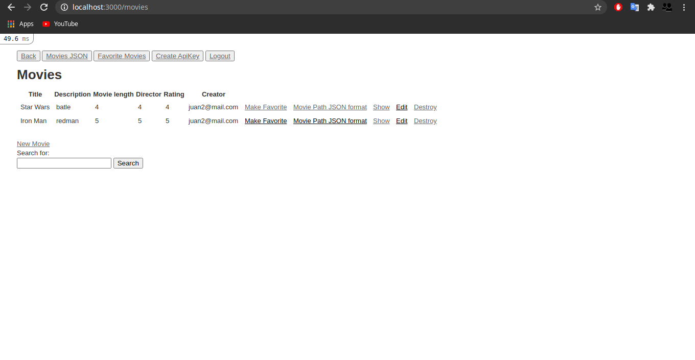

# MovieTest
Movietest is an API to store movies information, each movie has attributes specified in the /db/schema.rb file, through the browser you can create a session to add movies to the database, you can rate a movie as your movie favorite, you can access your favorites movies, and you can search the database for movies that match your search in title or description.
To use the API version you must generate an api_key (you will only be assigned an api_key if you are a registered user and have an active session) and pass in as a reader option for authorization in your http header like this:
_____
_____

curl http://localhost:3000/api/v1/movies -H 'Authorization: Token token="your token here incluiding quotes"'
_____
_____

After that you can access to the list of movies as a .json file.

Or if you are looking for a specific movie

_____
_____

curl http://localhost:3000/api/v1/movies/(movie:id) -H 'Authorization: Token token="your token here incluiding quotes"'
_____
_____



## :package: Built With

    - Ruby
    - Ruby on Rails
    - Devise
    - SQlite3
    - Yarn
    - Node
    - Rspec

##  Getting Started

### Prerequisites

Must have Ruby install on your local machine (version 3.0.0)\

Must have Ruby on Rails install on your local machine\


### Installation

*In your terminal enter:

```
 git clone https://github.com/jacobo12montes/movietest.git  (clone the repositorie)
 cd movietest/ (go in to the repositories folder)

```

*In the same terminal run bundle install and check for all the packages have been installed correctly

```
bundle install rspec

```

*To install RSpec open terminal and enter the following

```
gem install rspec

```

*In the browser navigate to `http://localhost:3000`

## :busts_in_silhouette: Author

👤 **Juan Hincapie**

- Linkedin: [Juan Hincapie](https://www.linkedin.com/in/juan-jacobo-hincapi%C3%A9-montes/)
- Github: [Juan github](https://github.com/jacobo12montes)